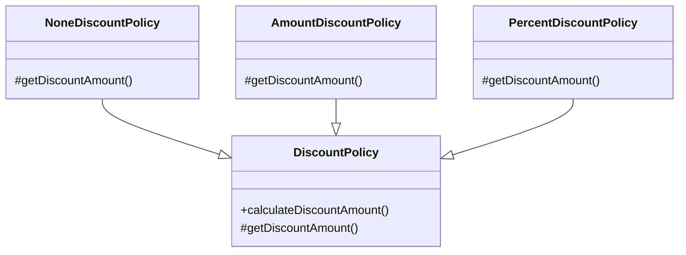
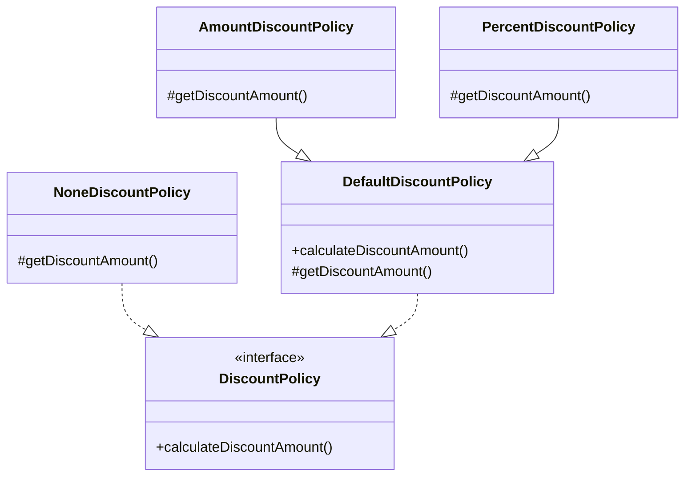

# [오브젝트](https://www.aladin.co.kr/shop/wproduct.aspx?ItemId=193681076)
## [chapter01 객체, 설계](https://github.com/hwangintae/object/pull/1)
변경하기 쉬운 코드를 작성하는 것은 항상 고민이 되는 일이다. 오늘의 최선이 내일엔 최악의 선택이 될 수 있다.

설계를 할때 mermaid를 이용하여 classDiagram을 그리고 객체가 어떤 행위를 하는지 고민을 하는데

책 내용중 '객체를 의인화 하고, 애니메이션을 만든다는 생각해라' 라는 내용을 참고하여

'도메인 설계'를 한다 라기 보단 '000 애니메이션'을 만든다고 생각을 하면서 설계를 해봐야겠다.

## [chapter02 객체지향 프로그래밍](https://github.com/hwangintae/object/pull/2)
개발을 하면서 공통 코드를 추출하기 위해 추상 클래스를 사용하였다.
그리고 구현체에 의존하지 않기 위해 인터페이스를 사용하였다.

그러나 요구사항이 추가, 수정될 때 오히려 추상 클래스로 인해 개발이 어려워졌다.
인터페이스를 사용했을 때 중복되는 코드를 어떻게 해결해야할지 몰랐다.

요구사항이 복잡해질 때마다 항상 발목을 잡는 부분이였다.

책을 보면 해법은 간단했다. 인터페이스를 만들어 직접 상속하게 만드는 방법이였다.



```java
public interface DiscountPolicy {
    Money calculateDiscountAmount(Screening screening);
}

public abstract class DefaultDiscountPolicy implements DiscountPolicy { ... }

public class NoneDiscountPolicy implements DiscountPolicy { ... }

public class AmountDiscountPolicy extends DefaultDiscountPolicy { ... }

public class PercentDiscountPolicy extends DefaultDiscountPolicy { ... }
```

나의 문제점은 추상 클래스와 인터페이스의 장점을 서로 연결하지 못한 문제가 있었다.

적절한 해법을 찾았다. 앞으로 좋은 객체지향 설계를 할 수 있길 기대해본다.

## [chapter03 역할, 책임, 협력](https://github.com/hwangintae/object/pull/3)
행동이 상태를 결정한다는 부분이 인상적이었다. 보통은 객체의 속성(상태)을 먼저 정의하고 메서드를 생성 했는데,
협력과 책임을 먼저 생각하면 훨씬 유연한 설계가 가능하다는 점을 알게되었다.