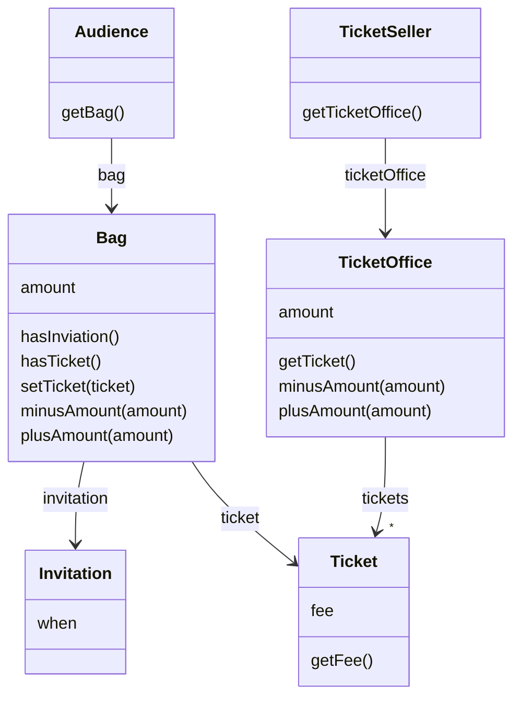
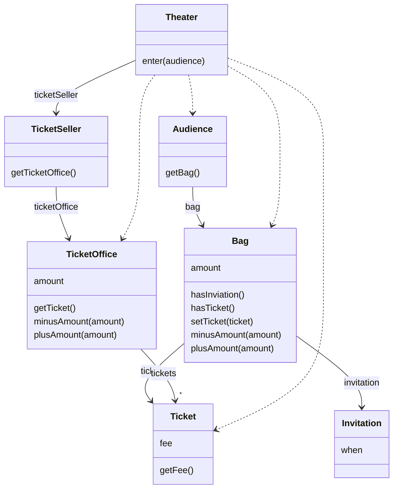
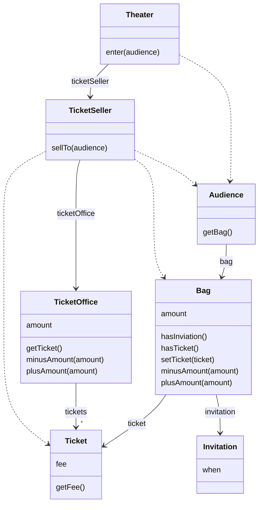
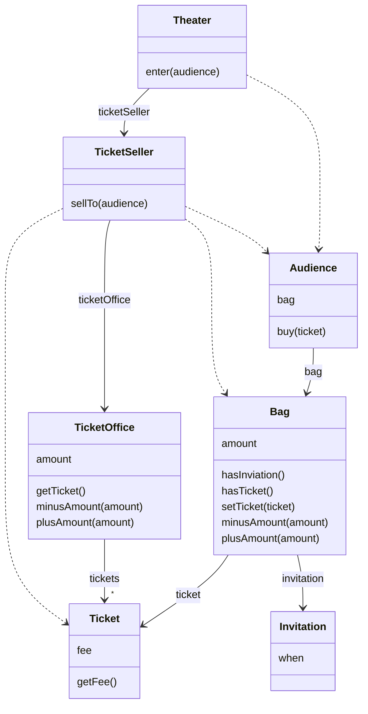
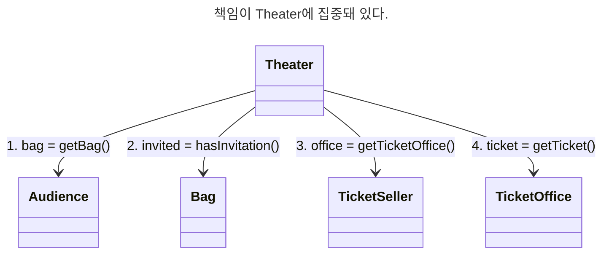
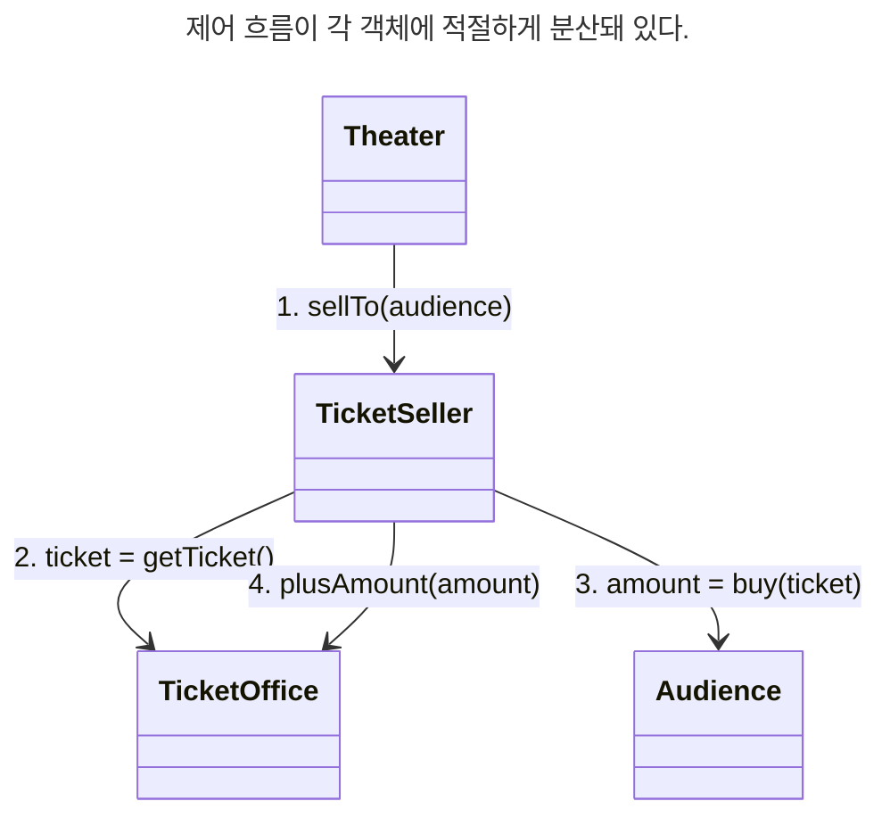
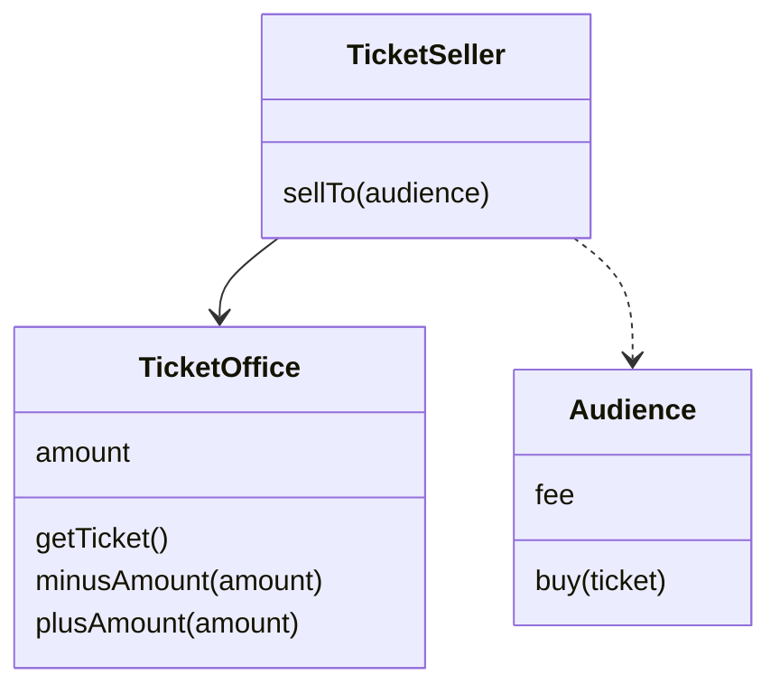
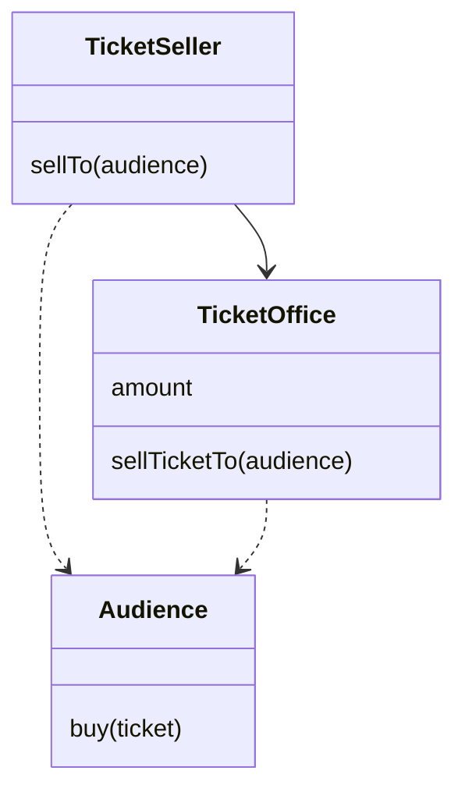

# chapter01 객체, 설계

소프트웨어 설계와 유지보수는 이론이 아닌 실무에 초점을 맞추는것이 효과적이다.

## 01 티켓 판매 application 구현하기
이벤트 당첨자에게 발송되는 초대장 구현하기

```java
public class Invitation {
	private LocalDateTime when;
}

public class Ticket {
	private Long fee;

	public Long getFee() {
		return fee;
	}
}
```

관람객이 가지고 올 수 있는 소품은 초대장, 현금, 티켓 세 가지뿐이다.

관람객은 소지품을 보관 용도로 가방을 들고 올 수 있다고 가정하자

```java
public class Bag {
	private Long amount;
	private Invitation invitation;
	private Ticket ticket;

	public boolean hasInvitation() {
		return invitation != null;
	}

	public boolean hasTicket() {
		return ticket != null;
	}

	public void setTicket(Ticket ticket) {
		this.ticket = ticket;
	}

	public void minusAmount(Long amount) {
		this.amount -= amount;
	}

	public void plusAmount(Long amount) {
		this.amount += amount;
	}
}
```

이벤트에 당첨된 관람객의 가방 안에는 현금과 초대장이 들어있고,
이벤트에 당첨되지 않은 관람객의 가방 안에는 초대장이 들어 있지 않다.

```diff
public class Bag {
	private Long amount;
	private Invitation invitation;
	private Ticket ticket;

+	public Bag(long amount) {
+		this(null, amount);
+	}

+	public Bag(Invitation invitation, long amount) {
+		this.invitation = invitation;
+		this.amount = amount;
+	}

	public boolean hasInvitation() {
		return invitation != null;
	}

	public boolean hasTicket() {
		return ticket != null;
	}

	public void setTicket(Ticket ticket) {
		this.ticket = ticket;
	}

	public void minusAmount(Long amount) {
		this.amount -= amount;
	}

	public void plusAmount(Long amount) {
		this.amount += amount;
	}
}
```

관람객을 구현하는 Audience class를 만들자. 관람객은 소지품을 보관하기 위해 가방을 소지한다.

```java
public class Audience {
	private Bag bag;

	public Audience(Bag bag) {
		this.bag = bag;
	}

	public Bag getBag() {
		return bag;
	}
}
```

매표소에는 티켓과 티켓 판매 금액이 보관돼 있어야 한다.

```java
public class TicketOffice {
    private Long amount;
    private List<Ticket> tickets = new ArrayList<>();

    public TicketOffice(Long amount, Ticket... tickets) {
        this.amount = amount;
        this.tickets.addAll(Arrays.asList(tickets));
    }

    public Ticket getTicket() {
        return tickets.removeFirst();
    }

    public void minusAmount(Long amount) {
        this.amount -= amount;
    }

    public void plusAmount(Long amount) {
        this.amount += amount;
    }
}
```

판매원은 매표소에서 초대장을 티켓으로 교환해 주거나 티켓을 판매하는 역할을 수행한다.
판매원은 자신이 일하는 매표소를 알고 있어야 한다.

```java
public class TicketSeller {
    private TicketOffice ticketOffice;
    
    public TicketSeller(TicketOffice ticketOffice) {
        this.ticketOffice = ticketOffice;
    }
    
    public TicketOffice getTicketOffice() {
        return ticketOffice;
    }
}
```



극장 class가 관람객을 맞이할 수 있도록 enter 메서드를 구현

```java
public class Theater {
    private TicketSeller ticketSeller;

    public Theater(TicketSeller ticketSeller) {
        this.ticketSeller = ticketSeller;
    }

    public void enter(Audience audience) {
        if (audience.getBag().hasInvitation()) {
            Ticket ticket = ticketSeller.getTicketOffice().getTicket();

            audience.getBag().setTicket(ticket);
        } else {
            Ticket ticket = ticketSeller.getTicketOffice().getTicket();

            audience.getBag().minusAmount(ticket.getFee());

            ticketSeller.getTicketOffice().plusAmount(ticket.getFee());

            audience.getBag().setTicket(ticket);
        }
    }
}
```

## 02 무엇이 문제인가
- software module : 크기와 상관 없이 class 나 package, library 와 같이 프로그램을 구성하는 임의의 요소
- software module 의 목적
1. 실행 중 제대로 동작
2. 간단한 작업만으로도 변경이 가능해야 한다.
3. 코드를 읽는 사람과 의사소통

#### 예상을 빗나가는 코드
기존의 Theater class의 enter 메서드는 관람객과 판매원을 통제한다.

1. 소극장이라는 제 3자가 초대장을 확인하기 위해 관람객의 가방을 열어 본다.
2. 소극장이 판매원의 허락도 없이 매표소에 보관 중인 티켓과 현금에 마음대로 접근할 수 있다.

> 티켓을 꺼내 관람객의 가방에 집어넣고 관람객에게서 받은 돈을 매표소에 적립하는 일을 소극장이 수행한다.

Theater의 enter 메서드를 이해하기 위해서
1. Audience가 Bag을 가지고 있다.
2. Bag 안에는 현금과 티켓이 들어있다.
3. TicketSeller가 TicketOffice에서 티켓을 판매한다.
4. TicktetOffice 안에 돈과 티켓이 보관돼 있다.

> - 하나의 class 나 메서드에서 너무 많은 세부사항을 다룬다.
> - Audience와 TicketSeller를 변경할 경우 Theater도 변경해야 한다.

#### 변경에 취약한 코드

의존성은 변경에 대한 영향을 암시한다. 어떤 객체가 변경될 때 그 객체에게 의존하는 다른 객체도 함께 변경될 수 있다.

**객체지향 설계는 서로 의존하면서 협력하는 객체들의 공동체를 구축하는것**



## 03 설계 개선하기

Theater 가 관람객의 가방과 판매원의 매표소에 직접 전근하기 때문이다.

이것은 관람객과 판매원이 자신의 일을 스스로 처리해야 한다는 우리의 직관을 벗어난다.

의도를 정확하게 의사 소통하지 못하기 때문에 코드가 이해하기 어려워진 것

Theater 가 관람객의 가방과 판매원의 매표소에 직접 접근한다는 것은 Theater 가 Audience 와 TicketSeller에 결합된다는 것을 의미

#### 자율성을 높이자
```diff
public class Theater {
    private TicketSeller ticketSeller;

    public Theater(TicketSeller ticketSeller) {
        this.ticketSeller = ticketSeller;
    }

    public void enter(Audience audience) {
-        if (audience.getBag().hasInvitation()) {
-            Ticket ticket = ticketSeller.getTicketOffice().getTicket();
-
-            audience.getBag().setTicket(ticket);
-        } else {
-            Ticket ticket = ticketSeller.getTicketOffice().getTicket();
-
-            audience.getBag().minusAmount(ticket.getFee());
-
-            ticketSeller.getTicketOffice().plusAmount(ticket.getFee());
-
-            audience.getBag().setTicket(ticket);
-        }
+        ticketSeller.sellTo(audience);
    }
}
```

```diff
public class TicketSeller {
    private TicketOffice ticketOffice;

    public TicketSeller(TicketOffice ticketOffice) {
        this.ticketOffice = ticketOffice;
    }
    
-    public TicketOffice getTicketOffice() {
-        return ticketOffice;
-    }

+    public void sellTo(Audience audience) {
+        if (audience.getBag().hasInvitation()) {
+            Ticket ticket = ticketOffice.getTicket();
+
+            audience.getBag().setTicket(ticket);
+        } else {
+            Ticket ticket = ticketOffice.getTicket();
+
+            audience.getBag().minusAmount(ticket.getFee());
+
+            ticketOffice.plusAmount(ticket.getFee());
+
+            audience.getBag().setTicket(ticket);
+        }
+    }
}
```

TicketSeller 에서 getTicketOffice 메서드가 제거됐다. 

외부에서 ticketOffice에 직접 접근할 수 없다. 결과적으로 ticketOffice에 대한 접근은 오직 ticketSeller 안에만 존재한다.

따라서, TicketSeller는 ticketOffice에서 티켓을 꺼내거나 판매 요금을 적립하는 일을 스스로 수행할 수밖에 없다.

Theater는 오직 TicketSeller의 interface에만 의존한다.

TicketSeller가 내부에 TicketOffice 인스턴스를 포함하고 있다는 사실은 구현의 영역에 속한다.



Theater의 로직을 TicketSeller로 이동시킨 결과, Theater에서 TicketOffice로의 의존성이 제거됐다.
TicketOffice와 협력하는 TicketSeller의 내부 구현이 성공적으로 캡슐화 됐다.

```diff
public class Audience {
    private Bag bag;

    public Audience(Bag bag) {
        this.bag = bag;
    }
    
-    public Bag getBag() {
-        return bag;
-    }

+    public Long buy(Ticket ticket) {
+        if (bag.hasInvitation()) {
+            bag.setTicket(ticket);
+            
+            return 0L;
+        } else {
+            bag.setTicket(ticket);
+            bag.minusAmount(ticket.getFee());
+            
+            return ticket.getFee();
+        }
+    }
}
```

```diff
public class TicketSeller {
    private TicketOffice ticketOffice;

    public TicketSeller(TicketOffice ticketOffice) {
        this.ticketOffice = ticketOffice;
    }

    public void sellTo(Audience audience) {
-        if (audience.getBag().hasInvitation()) {
-            Ticket ticket = ticketOffice.getTicket();
-
-            audience.getBag().setTicket(ticket);
-        } else {
-            Ticket ticket = ticketOffice.getTicket();
-
-            audience.getBag().minusAmount(ticket.getFee());
-
-            ticketOffice.plusAmount(ticket.getFee());
-
-            audience.getBag().setTicket(ticket);
-        }
+        ticketOffice.plusAmount(audience.buy(ticketOffice.getTicket()));
    }
}
```



#### 무엇이 개선됐는가

Audience와 TicketSeller는 자신이 가지고 있는 소지품을 스스로 관리한다.

**Audience나 TicketSeller의 내부 구현이 변경하더라도 Theater를 함께 변경할 필요가 없어졌다.**

1. Audience가 가방이 아니라 지갑을 소지하도록 코드 변경?
2. TicketSeller가 매표소가 아니라 은행에 돈을 보관?

두 경우 모두 변경은 Audience와 TicketSeller 내부만 변경하면 된다.

> 수정된 코드는 변경 용이성의 측면에서도 확실히 개선되었다.

#### 어떻게 한 것인가
1. 판매자가 티켓을 판매하기 위해 TicketOffice를 사용하는 모든 부분을 TicketSeller 내부로 이동
2. 관람객이 티켓을 구매하기 위해 Bag을 사용하는 모든 부분을 Audience 내부로 이동

> - 자기 자신의 문제를 스스로 해결하도록 코드를 변경
> - 우린 직관을 따랐고 그 결과로 코드는 변경이 용이하고 이해 가능하도록 수정됨
> - 객체의 자율성을 높이는 방향으로 설계를 개선

#### 캡슐화와 응집도
**객체의 응집도를 높이기 위해서는 객체 스스로 자신의 데이터를 책임져야 한다.**

객체는 자신의 데이터를 스스로 처리하는 자율적인 존재여야 한다.

#### 절차지향과 객체지향
[수정 전]

Theater의 enter 메서드 안에서 Audience와 TicketSeller로 부터 Bag과 TicketOffice를 가져와
관람객을 입장시키는 절차를 구현했다.

이 관점에서 theater의 enter 메서드는 **process**이며 Audience, TicketSeller, Bag, TicketOffice는 **data** 다.

이처럼 process와 data를 별도의 모듈에 위치시키는 방식을 **절차적 프로그래밍**이라고 부른다.

절차적 프로그래밍은 data의 변경으로 인한 영향을 지역적으로 고립시키기 어렵다는 것

절차적 프로그래밍의 세상은 변경하기 어려운 코드를 양산하는 경향이 있다.

[수정 후]

data를 사용하는 process가 data를 소유하고 있는 객체의 내부로 옮겨졌다.

이처럼 data와 process가 동일한 모듈 내부에 위치하도록 하는 방식을 **객체지향 프로그래밍** 이라고 부른다.

훌륭한 객체지향 설계의 핵심은 캡슐화를 이용해 의존성을 적절히 관리함으로써 객체 사이의 결합도를 낮추는 것

#### 책임의 이동




설계를 어렵게 만드는 것은 **의존성**이다. 해결 방법은 불필요한 의존성을 제거하고
객체 사이의 **결합도**를 낮추는 것이다. 결합도를 낮추기 위해 선 Theater가 몰라도 되는 
세부사항을 Audience와 TicketSeller 내부로 감춰 **캡슐화**한는 것이다.

#### 더 개선할 수 있다.
Audience는 자율적인 존재다. 하지만 Bag은 수동적인 존재다.

```diff
public class Bag {
    private Long amount;
    private Invitation invitation;
    private Ticket ticket;

    public Bag(long amount) {
        this(null, amount);
    }

    public Bag(Invitation invitation, long amount) {
        this.invitation = invitation;
        this.amount = amount;
    }
    
-    public Long hold(Ticket ticket) {
-        if (hasInvitation()) {
-            setTicket(ticket);
-            return 0L;
-        } else {
-            setTicket(ticket);
-            minusAmount(ticket.getFee());
-
-            return ticket.getFee();
-        }
-    }

-    public boolean hasInvitation() {
+    private boolean hasInvitation() {
        return invitation != null;
    }

-    public boolean hasTicket() {
-        return ticket != null;
-    }

-    public void setTicket(Ticket ticket) {
+    private void setTicket(Ticket ticket) {
        this.ticket = ticket;
    }

-    public void minusAmount(Long amount) {
+    private void minusAmount(Long amount) {
        this.amount -= amount;
    }

-    public void plusAmount(Long amount) {
-        this.amount += amount;
-    }
}
```

```diff
public class TicketOffice {
    private Long amount;
    private List<Ticket> tickets = new ArrayList<>();

    public TicketOffice(Long amount, Ticket... tickets) {
        this.amount = amount;
        this.tickets.addAll(Arrays.asList(tickets));
    }

    public Ticket getTicket() {
        return tickets.removeFirst();
    }

    public void minusAmount(Long amount) {
        this.amount -= amount;
    }

    public void plusAmount(Long amount) {
        this.amount += amount;
    }

+    public void sellTicketTo(Audience audience) {
+        plusAmount(audience.buy(getTicket()));
+    }
}
```

```diff
public class TicketSeller {
    private TicketOffice ticketOffice;

    public TicketSeller(TicketOffice ticketOffice) {
        this.ticketOffice = ticketOffice;
    }

    public void sellTo(Audience audience) {
-        ticketOffice.plusAmount(audience.buy(ticketOffice.getTicket()));
+        ticketOffice.sellTicketTo(audience);
    }
}
```

TicketOffice와 Audience 사이에 의존성이 추가됐다. 변경 전에는 존재하지 않았던 새로운 의존성이 추가된 것





Audience에 대한 결합도와 TicketOffice의 자율성 모두를 만족시키는 방법이 잘 떠오르지 않는다.

**트레이드오프**의 시점이 왔다.

#### 그래, 거짓말이다!
Theater, Bag, TicketOffice는 실세계에서 자율적인 존재가 아니다.
그럼에도 우리는 이들을 관람객이나 판매원 같은 생물처럼 다뤘다.

무생물 역시 스스로 행동하고 자기 자신을 책임지는 자율적인 존재로 취급한 것

능동적이고 자율적인 존재로 소프트웨어 객체를 설계하는 원칙을 **의인화**라고 부른다.

## 04 객체지향 설계
#### 설계가 왜 필요한가
좋은 설계란 오늘 요구하는 기능을 온전히 수행하면서 내일의 변경을 매끄럽게 수용할 수 있는 설계

요구사항 변경은 필연적으로 코드 수정을 초래하고, 코드 수정은 버그가 발생할 가능성을 높인다.

#### 객체지향 설계
객체는 자신의 데이터를 스스로 책임지는 자율적인 존재다. 그러나 단순히 데이터와 프로세스를 객체라는 덩어리 안으로 밀어 넣었다고 해서
변경하기 쉬운 설꼐를 얻을 수 있는 것은 아니다.

객체지향 세계에서 application은 객체들로 구성되며 application의 기능은 객체들 간의 상호작용을 통해 구현된다.

application 기능을 구현하기 위해 객체들이 협력하는 과정 속에서 객체들은 다른 객체에 의존하게 된다.

TicketSeller가 Audience에 메시지를 전송하기 위해서는 Audience에 대해 알고 있어야 한다.
메시지를 전송하기 위한 이런 지식이 두 객체를 결합시키고 이 결합이 객체 사이의 **의존성**을 만든다.

**훌륭한 객체지향 설꼐란 협력하는 객체 사이의 의존성을 적절하게 관리하는 설계다.**

