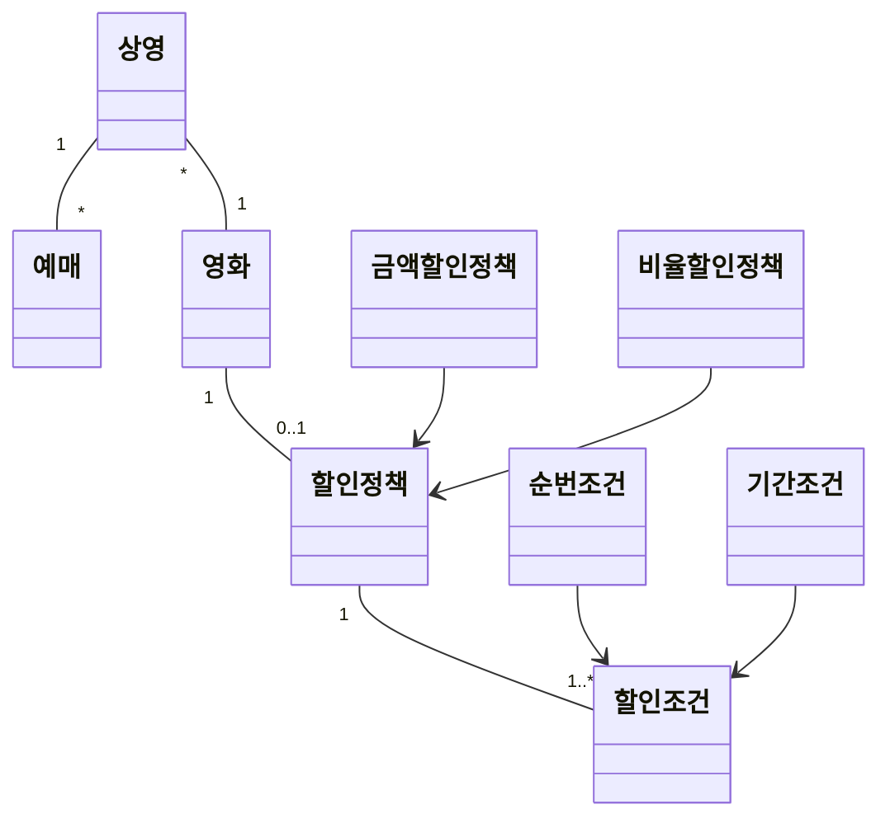
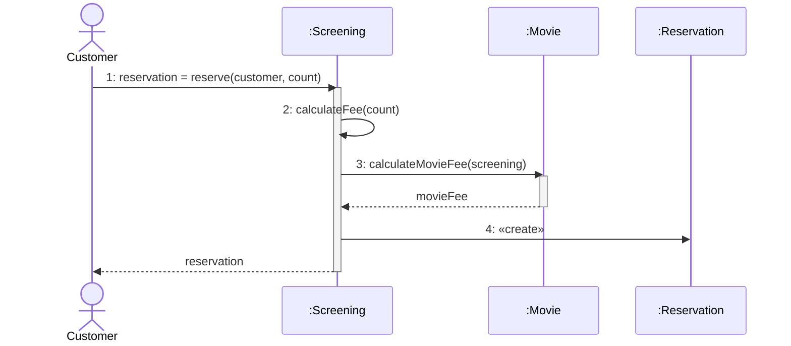
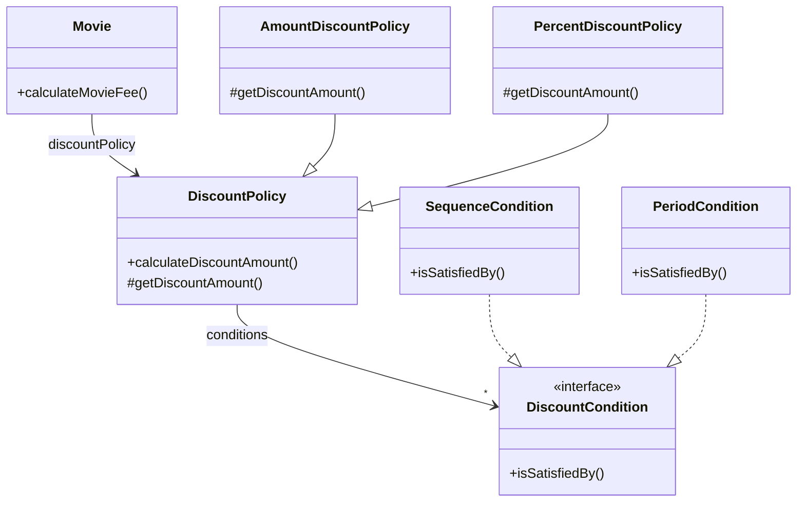
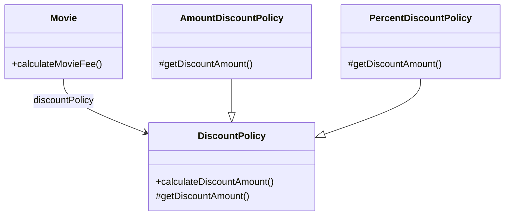
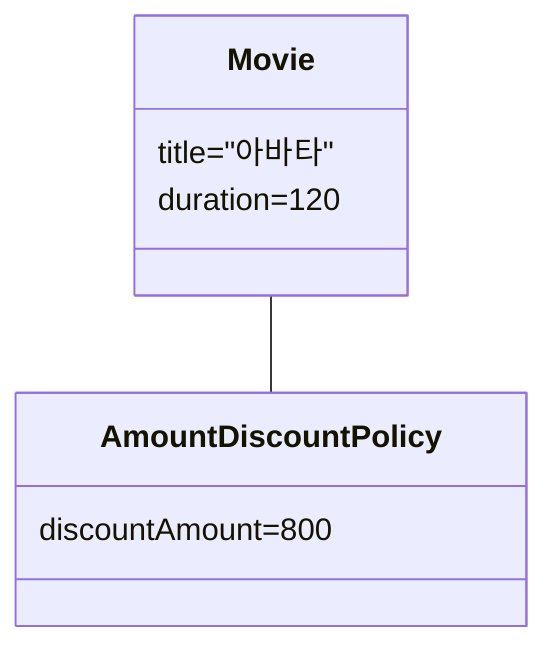
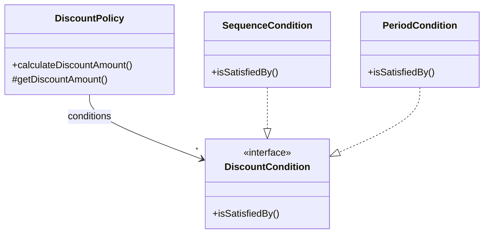
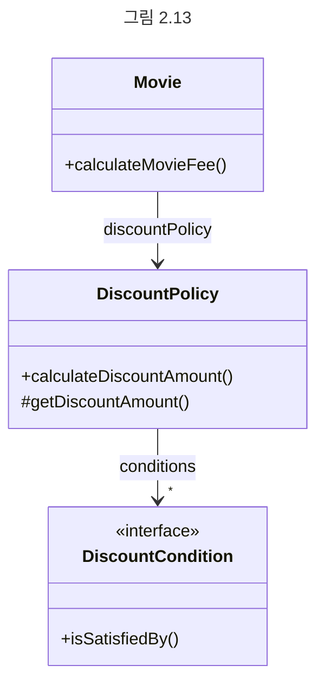
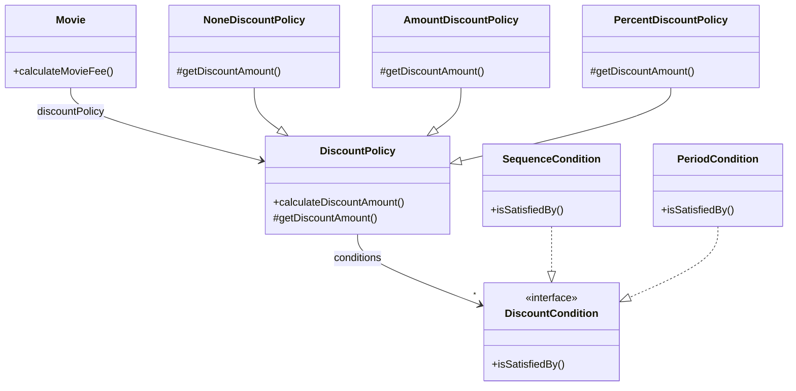
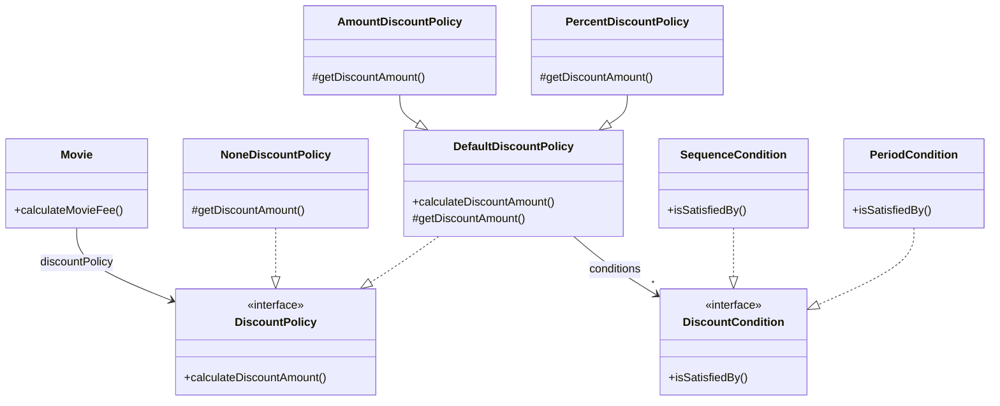
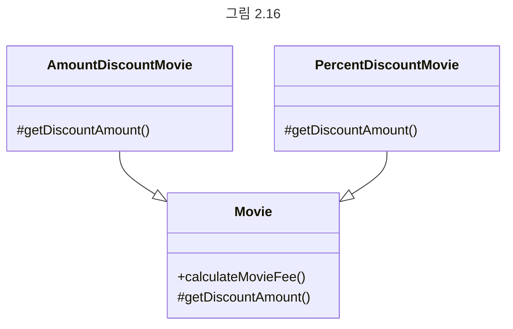

# chapter02 객체지향 프로그래밍

## 01 영화 예매 시스템

#### 용어 정리

- 영화 : 영화에 대한 기본 정보. 제목, 상영시간, 가격 정보 등
- 상영 : 실제로 관객들이 영화를 관람하는 사건. 상영 일자, 시간, 순번 등

#### 상황

영화는 하루 중 다양항 시간대에 걸쳐 한 번 이상 상영될 수 있다.

#### 조건

- 할인 조건
    - 순서 조건
        - 상영 순번을 이용해 할인 여부를 결정하는 규칙
        - 예) 순서 조건의 순번이 10인 경우 매일 10번쨀 ㅗ상영되는 영화를 예매한 사용자들에게 할인 혜택 제공
    - 기간 조건
        - 영화 상영 시작 시간을 이용해 할인 여부를 결정
        - 요일, 시작 시간, 종료 시간의 세 부분으로 구성되며 영화 시작 시간이 해당 기간 안에 포함될 경우 요금을 할인
        - 예) 월요일 오전 10시 부터 오후 1시 사이에 상영되는 모든 영화에 대해 할인 혜택 적용
- 할인 정책
    - 금액 할인 정책
        - 예매 요금에서 일정 금액을 할인해주는 방식
        - 예) 영화 가격이 9_000원이고 금액 할인 정책이 800원일 경우 가격은 8_200원
    - 비율 할인 정책
        - 정가에서 일정 비율의 요금을 할인
        - 예) 10%의 비율 할인 정책이면 9_000원의 10%를 할인

| 영화                                | 할인 정책                      | 할인 조건                                   |
|-----------------------------------|----------------------------|-----------------------------------------|
| **아바타**<br>(가격: 10_000원)          | **할인 정책**<br>(할인액: 800원)   | **순번 조건**<br>조조 상영                      |
|                                   |                            | **순번 조건**<br>10회 상영                     |
|                                   |                            | **기간 조건**<br>월요일 10:00 ~ 12:00 사이 상영 시작 |
|                                   |                            | **기간 조건**<br>목요일 18:00 ~ 21:00 사이 상영 시작 |
| **타이타닉**<br>(가격: 11_000원)         | **비율 할인 정책**<br>(할인율: 10%) | **기간 조건**<br>화요일 14:00 ~ 17:00 사이 상영 시작 |
|                                   |                            | **순번 조건**<br>2회 상영                      |
|                                   |                            | **기간 조건**<br>목요일 10:00 ~ 14:00 사이 상영 시작 |
| **스타워즈: 깨어난 포스**<br>(가격: 10_000원) | 없음                         | 없음                                      |

## 02 객체지향 프로그래밍을 향해

대부분의 사람들은 class를 결정한 후에 class에 어떤 속성과 메서드가 필요한지 고민한다.

**안타깝게도 이것은 객체지향의 본질과는 거리가 멀다.**

진정한 객체지향 패러다임으로의 전환

1. 어떤 class가 필요한지 고민하기 전에 어떤 객체들이 필요한지 고민하라
    2. class는 공통적인 상태와 행동을 공유하는 객체들을 추상화한 것
3. 객체를 독립적인 존재가 아니라 기능을 구현하기 위해 협력하는 공동체의 일원으로 봐야 한다.
    4. 객체를 협력하는 공동체의 일원으로 바라보는 것은 설계를 유연하고 확장 가능하게 만든다.
5. 객체들의 모양과 윤곽이 잡히면 공통된 특성과 상태를 가진 객체들을 타입을 ㅗ분류하고 이 타입을 기반으로 class를 구현해라

### 도메인의 구조를 따르는 프로그램 구조



영화 예매 도메인을 구성하는 개념과 관계를 표현한 것

1. 영화는 여러 번 상영될 수 있다.
2. 상영는 여러 번 예매될 수 있다는 것을 알 수 있다.
3. 영화애는 할인 정책을 할당하지 않거나 할당하더라도 오직 하나만 할당할 수 있다.
4. 할인 정책이 존재하는 경우에는 하나 이상의 할인 조건이 반드시 존재한다.

### 클래스 구현하기

도메인 개념들의 구조를 반영하는 적절한 클래스 구조를 만들었다고 가정하자.
이제 남은 일은 적절한 프로그래밍 언어를 이용해 이 구조를 구현하는 것

```java
public class Screening {
    private Movie movie;
    private int sequence;
    private LocalDateTime whenScreened;

    public Screening(Movie movie, int sequence, LocalDateTime whenScreened) {
        this.movie = movie;
        this.sequence = sequence;
        this.whenScreened = whenScreened;
    }

    public LocalDateTime getWhenScreened() {
        return whenScreened;
    }

    public boolean isSequence(int sequence) {
        return this.sequence == sequence;
    }

    public Money getMovieFee() {
        return movie.getFee();
    }
}

public class Movie {
    private Money fee;

    public Movie(Money fee) {
        this.fee = fee;
    }

    public Money getFee() {
        return fee;
    }
}
```

클래스는 내부와 외부로 구분되며 훌륭한 클래스를 설계하기 위한 핵심은
어떤 부분을 외부에 공개하고 어떤 부분을 감출지를 결정하는 것이다.

그래야 경계의 명확성이 객체의 자율성을 보장하기 때문이다.

#### 자율적인 객체

1. 객체가 **상태**와 **행동**을 함게 가지는 복합적인 존재다.
2. 객체가 스스로 판단하고 행동하는 **자율적인 존재**다.

캡슐화와 접근 제어는 객체를 두 부분으로 나눈다.

1. 외부에서 접근 가능한 public interface
2. 외부에서 접근 불가능하고 오직 내부에서만 접근 가능한 implementation

interface와 implementaion의 분리 원칙은 훌륭한 객체지향 프로그램을 만들기 위해 따라야 하는 핵심 원칙이다.

#### 프로그래머의 자유

프로그래머의 역할을 class creator와 client programmer로 구분하는 것이 유용하다.

client programmer의 목표는 필요한 클래스들을 엮어서 application을 빠르고 안정적으로 구축하고,
class creator는 필요한 부분만 공개하고 나머지는 숨겨야 한다.

숨겨 놓은 부분에 마음대로 접근할 수 없도록 방지함으로써 client programmer에 대한 영향을 걱정하지 않고도
내부 구현을 마음대로 변경할 수 있다. 이를 **구현 은닉**이라고 부른다.

### 협력하는 객체들의 공동체

```java
public class Screening {
    public Reservation reserve(Customer customer, int audienceCount) {
        return new Reservation(customer, this, calcuateFee(audienceCount), audienceCount);
    }
}
```

Screening의 reserve 메서드를 보면 calculateFee라는 private 메서드를 호출해서 그 결과를 Reservation의 생성자에 전달한다.
calculateFee 메서드는 요금을 계산하기 위해 다시 Movie의 calculateMovieFee 메서드를 호출한다.

```java
private Money calculateFee(int audienceCount) {
    return movie.calculateMovieFee(this).times(audienceCount);
}
```

Money는 금액과 관련된 다양한 계산을 구현한 class

```java
public class Money {
    public static final Money ZERO = Money.wons(0);

    private final BigDecimal amount;

    public Money(BigDecimal amount) {
        this.amount = amount;
    }

    public static Money wons(long amount) {
        return new Money(BigDecimal.valueOf(amount));
    }

    public static Money wons(double amount) {
        return new Money(BigDecimal.valueOf(amount));
    }

    public Money plus(Money amount) {
        return new Money(this.amount.add(amount.amount));
    }

    public Money minus(Money amount) {
        return new Money(this.amount.subtract(amount.amount));
    }

    public Money times(double percent) {
        return new Money(this.amount.multiply(
                BigDecimal.valueOf(percent)));
    }

    public boolean isLessThan(Money other) {
        return amount.compareTo(other.amount) < 0;
    }

    public boolean isGreaterThanOrEqual(Money other) {
        return amount.compareTo(other.amount) >= 0;
    }
}
```

Loang 타입은 Money 타입처럼 저장하는 값이 금액과 관련돼 있다는 의미를 전달할 수 없다. 또한 금액과 관련된 로직이
서로 다른 곳에 중복되어 구현되는 것을 막을 수 있다. **그 개념이 비록 하나의 인스턴스 변수만 포함하더라도 개념을 명시적으로
표현하는 것은 전체적인 설계의 명확성과 유연성을 높인다.**

```java
public class Reservation {
    private Customer customer;
    private Screening screening;
    private Money fee;
    private int audienceCount;

    public Reservation(Customer customer, Screening screening, Money fee, int audienceCount) {
        this.customer = customer;
        this.screening = screening;
        this.fee = fee;
        this.audienceCount = audienceCount;
    }
}
```



### 협력에 관한 짧은 이야기

객체의 내부 상태는 외부에서 접근하지 못하도록 감춰야 한다. 대신 외부에 공개하는 public interface를 통해
내부 상태에 접근할 수 있도록 허용한다.

객체가 다른 객체와 상호작용할 수 있는 유일한 방법은 **메시지를 전송**하는 것뿐이다.

다른 객체에게 요청이 도착할 때 해당 객체가 **메시지를 수신**했다고 한다.

수신된 메시지를 처리하는 위한 자신만의 방법을 **메서드**라고 부른다.

Java와 같은 정적 타입 언어에는 해다오디지 않지만 Ruby나 Smalltalk 같은 동적 타입 언어에서는 다른 시그니처를 가진 메서드를 통해서도
해당 메시지에 응답할 수 있다. 결국 메시지를 처리하는 방법을 결정하는 것은 객체 스스로의 문제다.

## 03 할인 요금 구하기

```java
public class Movie {
    private String title;
    private Duration runningTime;
    private Money fee;
    private DiscountPolicy discountPolicy;

    public Movie(String title, Duration runningTime, Money fee, DiscountPolicy discountPolicy) {
        this.title = title;
        this.runningTime = runningTime;
        this.fee = fee;
        this.discountPolicy = discountPolicy;
    }

    public Money getFee() {
        return fee;
    }

    public Money calculateMovieFee(Screening screening) {
        return fee.minus(discountPolicy.calculateDiscountAmount(screening));
    }
}
```

calculateMovieFee에서 discountPolicy에는 어떤 할인 정책을 사용할 것인지 결정하는 코드가 없다.

이 코드에는 객체지향에서 중요하다고 여겨지는 두 가지 개념이 숨겨져 있다.

1. 상속
2. 다형성

### 할인 정책과 할인 조건

AmountDiscountPolicy와 PercentDiscountPolicy라는 class로 구현한다. 두 class는 대부분의 코드가 유사하고
할인 요금을 계산하는 방식만 조금 다르다. 따라서, DiscountPolicy라는 abstract class에 중복 코드를 두고 상속받게 한다.

```java
public abstract class DiscountPolicy {

    private List<DiscountCondition> conditions = new ArrayList<>();

    public DiscountPolicy(DiscountCondition... conditions) {
        this.conditions = Arrays.asList(conditions);
    }

    public Money calculateDiscountAmount(Screening screening) {
        for (DiscountCondition each : conditions) {
            if (each.isSatisfiedBy(screening)) {
                return getDiscountAmount(screening);
            }
        }

        return Money.ZERO;
    }

    abstract protected Money getDiscountAmount(Screening screening);
}
```



### 할인 정책 구성하기

하나의 영화에 대해 하나의 할인 정책만 설정할 수 있지만, 할인 조건은 여러 개를 적용할 수 있다.

Movie의 생성자는 하나의 DiscountPolicy 인스턴스만 받을 수 있다.

```java
public Movie(String title, Duration runningTime, Money fee, DiscountPolicy discountPolicy) {
    this.title = title;
    this.runningTime = runningTime;
    this.fee = fee;
    this.discountPolicy = discountPolicy;
}
```

반면 DiscountPolicy의 생성자는 여러 개의 DiscountCondition 인스턴스를 허용한다.

```mermaid
public DiscountPolicy(DiscountCondition... conditions) {
this.conditions = Arrays.asList(conditions);
}
```

이처럼 생성자의 파라미터 목록을 이용해 초기화에 필요한 정보를 전달하도록 강제하면
올바른 상태를 가진 객체의 생성을 보장할 수 있다.

## 04 상속과 다형성

Movie class 어디에도 할인 정책이 금액 할인 정책인지, 비율 할인 정책인지를 판단하지 않는다.

### 컴파일 시간 의존성과 실행 시간 의존성

Movie는 DiscountPolicy와 연결돼 있으며, AmountDiscountPolicy와 PercentDiscountPolicy는 추상 클래스인
DiscountPolicy를 상속받는다.

이처럼 어떤 class가 다른 class에 접근할 수 있는 경로를 가지거나 해당 class의 객체의 메서드를 호출할 경우
두 class 사이에 의존성이 존재한다고 말한다.



영화 요금을 계산하기 위해서는 추상 class인 DiscountPolicy가 아니라 AmountDiscountPolicy, PercentDiscountPolicy에 의존해야 한다.

하지만 코드 수준에서 Movie class는 이 두 class에 의존하지 않는다.

만약 영화 요금을 계산하기 위해 금액 할인 정책을 적용하고 싶다면 Movie의 인스턴스를 생성할 때 인자로 AmountDiscountPolicy의 인스턴스를 전다랗면 된다.

```java
Movie movie = new Movie("아바타",
        Duration.ofMinutes(120),
        Money.wons(10_000),
        new AmountDiscountPolicy(
                Money.wons(800),
                new SequenceCondition(1),
                new SequenceCondition(10),
                new PeriodCondition(DayOfWeek.MONDAY, LocalTime.of(10, 0), LocalTime.of(11, 59)),
                new PeriodCondition(DayOfWeek.THURSDAY, LocalTime.of(10, 0), LocalTime.of(20, 59))
        )
);
```



class의 의존성과 객체의 의존성은 동일하지 않을 수 있다. 확장 가능한 객체지향 설계가 가지는 특징은 코드의 의존성과 실행 시점의 의존성이 다르다는 것

간과하면 안되는 사실은 코드의 의존성과 실행 시점의 의존성이 다르면 다를수록 코드를 이해하기 어려워진다.

코드의 의존성과 실행 시점의 의존성이 다르면 다를수록 코드는 더 유연해지고 확장 가능해진다.

**이와 같은 의존성의 양면성은 설계가 트레이드오프의 산물이라는 사실을 잘 보여준다.**

**무조건 유연한 설계도, 무조건 읽기 쉬운 코드도 정답이 아니다.**

### 차이에 의한 프로그래밍

상속은 객체지향에서 코드를 재사용하기 위해 가장 널리 사용되는 방법이다. DiscountPolicy 에 정의된 모든 속성과 메서드를
그대로 물려받은 AmountDiscountPolicy, PercentDiscountPolicy class는 상곡의 강력함을 잘 보여주는 예다.

### 상속과 인터페이스

```java
public Money calculateMovieFee(Screening screening) {
    return fee.minus(discountPolicy.calculateDiscountAmount(screening));
}
```

Movie가 DiscountPolicy의 interface에 정의된 calculateDiscountAmount 메시지를 전송하고 있다.
Movie 입장에서는 자신과 협력하는 객체가 어떤 class의 인스턴스인지가 중요한 것이 아니라 calculateDiscountAmount 메시지를
수신할 수 있따는 사실이 중요하다.

### 다형성

메시지와 메서드는 다른 개념이다. Movie는 DiscountPolicy의 인스턴스에게 **calculateDiscountAmount 메시지를 전송**한다.
그러면 Movie와 상호작용하기 위해 **연결된 객체의 class가 오버라이딩한 메서드가 실행**될 것이다.

**다형성이란 동일한 메시지를 수신했을 때 객체의 타입에 따라 다르게 응답할 수 있는 능력**

### interface와 다형성

DiscountPolicy를 추상 class로 구현하여 자식 class들이 interface와 내부 구현을 함께 상속받았다.

할인 조건은 구현을 공유할 필요가 없기 때문에 interface를 이용해 타입 계층을 구현했다.



## 05 추상화와 유연성

### 추상화의 힘

추상화를 사용할 경우 두 가지 장점이 있다.

1. 추상화의 계층만 따로 떼어 놓고 살펴보면 요구사항의 정책을 높은 수준에서 서술할 수 있다.
2. 추상화를 이용하면 설계가 좀 더 유연하다.



그림 2.13을 하나의 문장으로 정리하면 "영화 예매 요금은 최대 하나의 '할인 정책'과 다수의 '할인 조건'을 이용해 계산할 수 있다."
로 표현할 수 있다.

추상화를 사용하면 세부적인 내용을 무시한 채 상위 정책을 쉽고 간단하게 표현할 수 있다.

### 유연한 설계

```java
public Money calculateMovieFee(Screening screening) {
    if (discountPolicy == null) {
        return fee;
    }

    return fee.minus(discountPolicy.calculateDiscountAmount(screening));
}
```

이 방식의 문제점은 할인 정책이 없는 경우를 예외 케이스로 취급하기 때문에
지금까지 일관성 있던 협력 방식이 무너지게 된다.

할인 정책이 없는 경우에는 할인 금액이 0원이라는 사실을 결정하는 책임이 DiscountPolicy가 아닌 Movie 쪽에 있기 때문이다.

일관성을 지킬 수 있는 방법은 할인 요금을 계산할 책임을 그대로 DiscountPolicy 계층에 유지시키는 것이다.

```java
public class NoneDiscountPolicy extends DiscountPolicy {
    @Override
    protected Money getDiscountAmount(Screening screening) {
        return Money.ZERO;
    }
}
```

기존의 Movie와 DiscountPolicy는 수정하지 않고 NoneDiscountPolicy라는 새로운 클래스를 추가하는 것만으로
애플리케이션의 기능을 확장했다는 것

**추상화가 유연한 설계를 가능하게 하는 이유는 설계가 구체적인 상황에 결합되는 것을 방지하기 때문**



> 결론은 간단하다. 유연성이 필요한 곳에 추상화를 사용하라.

### 추상 클래스와 인터페이스 트레이드오프

DiscountPolicy에서 할인 조건이 없을 경우 getDicountAmount() 메서드를 호출하기 않는다.

```java
public Money calculateDiscountAmount(Screening screening) {
    for (DiscountCondition each : conditions) {
        if (each.isSatisfiedBy(screening)) {
            return getDiscountAmount(screening);
        }
    }

    return Money.ZERO;
}
```

NoneDiscountPolicy의 개발자는 getDiscountAmount()가 호출되지 않을 경우 DiscountPolicy가 0원을 반환할 것이라는 사실을 가정한다.

이것은 부모 클래스인 DiscountPolicy와 NoneDiscountPolicy를 개념적으로 결합시킨다.

DiscountPolicy class를 interface로 변경하자

```java
public interface DiscountPolicy {
    Money calculateDiscountAmount(Screening screening);
}

public abstract class DefaultDiscountPolicy implements DiscountPolicy { ...
}

public class NoneDiscountPolicy implements DiscountPolicy {
    @Override
    public Money calculateDiscountAmount(Screening screening) {
        return Money.ZERO;
    }
}
```



> - 구현과 관련된 모든 것들이 트레이드오프의 대상이 될 수 있다.
> - 모든 코드에는 합당한 이유가 있어야 한다.
> - 고민하고 트레이드오프하라.

### 코드 재사용

Movie가 DiscountPolicy의 코드를 재사용하는 방법이 바로 합성이다.

그림 2.16과 같이 Movie를 직접 상속받아 AmountDiscountMovie와 PercentDiscountMovie라는 두 개의 클래스를 추가하면
합성을 사용한 기존 방법과 기능적인 관점에서 완벽히 동일하다.



그럼에도 상속 대신 합성을 사용하는 이유는 무엇일까?

### 상속
상속은 두 가지 관점에서 설꼐에 안 좋은 영향을 미친다.
1. 캡슐화를 위반한다.
   - 부모 클래스의 구현이 자식 클래스에 노출된다.
   - 부모 클래스를 변경할 때 자식 클래스도 함께 변경될 확률을 높인다.
2. 설계를 유연하지 못하게 만든다.
   - 부모 클래스와 자식 클래스 사이의 관계를 컴파일 시점에 결정하기 때문에 실행 시점에 객체의 종류를 변경하는 것이 불가능하다.

```diff
public class Movie {
    ...
    private DiscountPolicy discountPolicy;
    ...
+    public void changeDiscountPolicy(DiscountPolicy discountPolicy) {
+        this.discountPolicy = discountPolicy;
+    }
}
```

### 합성
Movie는 DiscountPolicy가 외부에 calculateDiscountAmount 메서드를 제공한다는 사실만 알고 내부 구현에 대해서는 전혀 알지 못한다.
이처럼 인터페이스에 정의된 메시지를 통해서만 코드를 재사용하는 방법을 **합성**이라고 부른다.

상속은 클래스를 통해 강하게 결합되는 데 비해 합성은 메시지를 통해 느슨하게 결합된다.
따라서 코드 재사용을 위해서는 상속보다는 합성을 선호하는 것이 더 좋은 방법이다.

그렇다고 상속을 절대 사용하지 말라는 것은 아니다.

