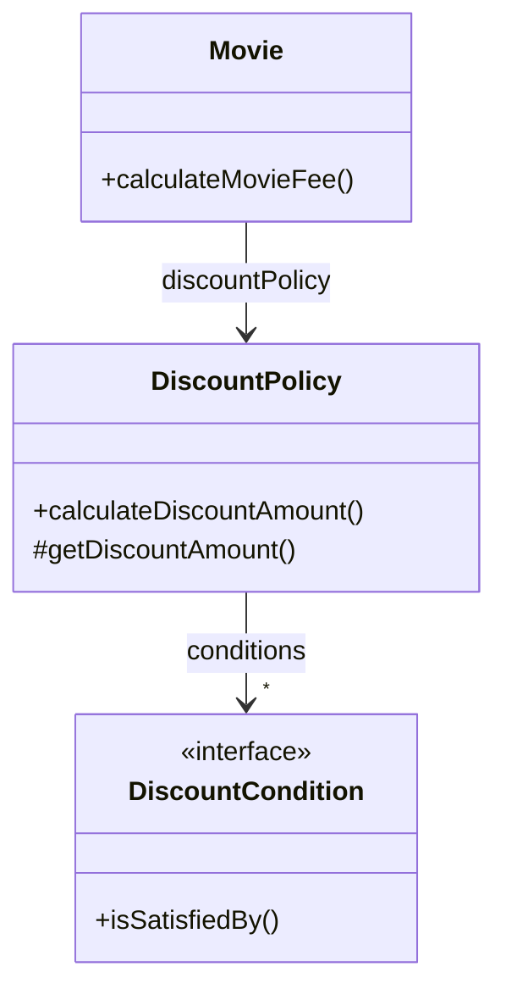

# chapter03 역할, 책임, 협력
application의 기능을 구현하기 위해 어떤 협력이 필요하고
협력을 위해 어떤 역할과 책임이 필요한지를 고민하지 않은 채
너무 이른 시기에 구현에 초점을 맞추는 것은
변경하기 어렵고 유연하지 못한 코드를 낳는 원인이 된다.

## 01 협력
### 영화 예매 시스템 돌아보기
객체지향 원칙을 따르는 application의 제어 흐름은 어떤 하나의 객체에 의해 통제되지 않고
다양한 객체들 사이에 균형 있게 분배되는 것이 일반적이다.

### 협력
메시지를 수신한 객체는 메서드를 실행해 요청에 응답한다. 외부 객체는 오직 메시지만 전송할 수 있을 뿐
메시지를 어떻게 처리할지는 메시지를 수신한 객체가 직접 결정한다.

### 협력이 설계를 위한 문맥을 결정한다
Movie의 행동을 결정하는 것은 영화 예매를 위한 협력이다.

객체는 자신의 상태를 스스로 결정하고 관리한는 자율적인 존재이기 때문에
객체가 수행하는 행동에 필요한 상태도 함께 가지고 있어야 한다.

Movie가 기본 요금인 fee와 할인 정책인 discountPolicy라는 인스턴스 변수를 상태의 일부로 포함하는 이유는
요금 계산이라는 행동을 수행하는 데 이 정보들이 필요하기 때문이다.

```java
public class Movie {
    private Money fee;
    private DiscountPolicy discountPolicy;

    public Money calculateMovieFee(Screening screening) {
        return fee.minus(discountPolicy.calculateDiscountAmount(screening));
    }
}
```

상태는 객체가 행동하는 데 필요한 정보에 의해 결정되고
행동은 협력 안에서 객체가 처리할 메시지로 결정된다.

따라서, 협력은 객체를 설계하는 데 필요한 일종의 **문맥(context)**을 제공한다.

## 02 책임
### 책임이란 무엇인가
객체에 의해 정의되는 응집도 있는 행위의 집합.
객체가 유지해야 하는 정보와 수행할 수 있는 행동에 대해 개략적으로 서술한 문장

즉, 객체의 책임은
1. 무엇을 알고 있는가
2. 무엇을 할 수 있는가
로 구성된다.

Screening

| 상영 정보를 알고 있다 | Movie |
|-------------|-------|
| 예매 정보를 생성한다 |

Movie

| 영화 정보를 알고 있다 | DiscountPolicy |
|--------------|----------------|
| 가격을 계산한다     |

DiscountPolicy

| 할인 정책을 알고 있다 | DiscountCondition |
|--------------|-------------------|
| 할인된 가격을 계산한다 |

DiscountCondition

| 할인 조건을 알고 있다 | Screening |
|--------------|-----------|
| 할인 여부를 판단한다  |

적절한 협력이 적절한 책임을 제공하고, 적절한 책임을 적절한 객체에게 할당해야만 단순하고 유연한 설계를 창조할 수 있다.

### 책임 할당
자율적인 객체를 만드는 가장 기본적인 방법은 가장 잘 알고 있는 전문가에게 그 책임을 할당하는 것.
이를 책임 할당을 위한 information expert pattern이라고 부른다.

객체에게 책임을 할당하기 위해서는 먼저 협력이라는 문맥을 정의해야 한다.

> 예) 영화 예매 시스템 
> - 시스템이 사용자에게 제공해야 할 기능은 영화를 예매하는 것
> - '예매하라'라는 이름의 메시지로 협력을 시작
>   - 영화를 예매하기 위해서는 상영 시간과 기본요금을 알고 있어야 한다.
>   - Screening
>   - Screening은 영화 가격 자체에 대해서는 정보 전문가가 아니다.
> - '가격을 계산하라'
>   - 가격을 계산하기 위해서는 가격과 할인 정책이 필요하다.
>   - Movie
>   - 가격을 계산하기 위해서는 할인 요금이 필요
>   - Movie는 할인 요금을 계산하는 데 적절하지 않다.

**이처럼 객체지향 설계는 협력에 필요한 메시지를 찾고
메시지에 적절한 객체를 선택하는 반복적인 과정을 통해 이뤄진다.**

어떤 경우에는 응집도와 결합도의 관점에서 다른 객체에게 책임을 할당하기도 한다.

### 책임 주도 설계
책임을 찾고 책임을 수행할 적절한 객체를 찾아 책임을 할당하는 방식으로 협력을 설계(Responsibility Driven Design, RDD)
- 시스템이 사용자에게 제공해야 하는 기능인 시스템 책임을 파악한다.
- 시스템 책임을 더 작은 책음으로 분할한다.
- 분할된 책임을 수행할 수 있는 적절한 객체 또는 역할을 찾아 책임을 할당
- 객체가 책임을 수행하는 도중 다른 객체의 도움이 필요한 경우 적절한 객체 또는 역할을 찾는다.
- 해당 객체 또는 역할에게 책임을 할당하여 두 객체가 협력하게 한다.

책임 주도 설계는 자연스럽게 객체의 구현이 아닌 책임에 집중할 수 있게 한다.

### 메시지가 객체를 결정한다
메시지가 객체를 선택해야 하는 두 가지 이유
1. 객체가 최소한의 인터페이스 (minimal interface)를 가질 수 있게 된다.
   - 필요한 메시지가 식별될 때까지 interface에 어떤 것도 추가하지 않기 때문
2. 충분히 추상적인 인터페이스 (abstract interface)를 가질 수 있게 된다.
   - 객체의 인터페이스는 무엇(what)을 하는지는 표현해야 하지만 어떻게(how) 수행하는지를 노출해선 안 된다.

### 행동이 상태를 결정한다
객체를 객체답게 만드는 것은 객체의 상태가 아니라 객체가 다른 객체에게 제공하는 행동이다.

협력 관계 속에서 다른 객체에게 무엇을 제공해야 하고
다른 객체로부터 무엇을 얻어야 하는지 고민해야 훌륭한 책임을 수확할 수 있다.

## 03 역할
### 역할과 협력
객체가 어떤 특정한 협력 안에서 수행하는 책임의 집합을 역할이라고 부른다.

영화 예매 협력에서 예매하라라는 메시지를 처리하기에 적합한 객체로 Screening을 석택했다.
하나의 단계처럼 보이는 이 책임 할당 과정은 실제로는 두 개의 독립적인 단계가 합쳐진 것이다.
1. 영화를 예매할 수 있는 적절한 역할이 무엇인가 찾기
2. 역할을 수행할 객체로 Screening 인스턴스를 선택

역할에 특별한 이름을 부여하지 않았지만 실제로는 익명의 역할을 찾고
그 역할을 수행할 수 있는 객체를 선택하는 방식으로 설계가 진행됐다고 생각하는 것이 자연스럽다.

**그렇다면 어떤 이유로 역할이라는 개념을 이용해서 설계 과정을 번거롭게 만드는 것일까?**

### 유연하고 재사용 가능한 협력
역할이 중요한 이유는 역할을 통해 유연하고 재사용 가능한 헙력을 얻을 수 있기 때문이다.

AmountDiscountPolicy와 PercentDiscountPolicy라는 두 가지 종류의 가격 할인 정책이 존재하기 때문에
두 가지 종류의 객체가 할인 요금을 계산하라 메시지에 응답할 수 있어야 한다.

그렇다면 두 종류의 객체가 참여하는 협력을 개별적으로 만들어야 할까?

순수하게 책임의 관점에서 두 협력을 바라보면 모두 할인 요금 계산이라는 동일한 책임을 수행한다.
따라서, 객체라는 존재를 지우고 *할인 요금을 계산하라*라는 메시지에 응답할 수 있는 대표자를 생각한다면
두 협력을 하나로 통합할 수 있다. 이 대표자를 협력 안에서 두 종류의 객체로 교대로 바꿔 끼울 수 있는
일종의 슬롯으로 생각할 수 있다. 이 슬롯이 바로 **역할**이다.

### 객체 대 역할
협력에 적절한 책임을 수행하는 대상이 한 종류하면 간단하게 객체로 간주하고,
여러 종류의 객체들이 참여할 수 있다면 역할이라고 부른다.

대부분의 경우에 어떤 것이 역할이고 어떤 것이 객체인지가 또렷하게 드러나지 않다.
설계 초반에는 적절한 책임과 협력의 큰 그림을 탐색하는 것이 가장 중요하다.
역할과 객체를 명확하게 구분하는 것은 그렇게 중요하지 않다.

애매하다면 단순하게 객체로 시작하고 반복적으로 책임과 협력을 정제해가면서 필요한 순가에 객체로부터 역할을 분리한다.

처음에 특정 시나리오에 대한 협력을 구상할 때 도메인 모델을 후보로 선택해 직접 책임을 할당한다.
다양한 시나리오를 설계로 옮기면서 협력을 지속적으로 정제하다 보면 두 협력이 거의 유사한 구조를 보인다는 것을 발견한다.
이 경우 두 협력을 하나로 합치면서 두 객체를 포관할 수 있는 역할을 고려해서 객체를 역할로 대체할 수 있다.

중요한 것은 협력을 구체적인 객체가 아니라 추상적인 역할의 관점에서 설계하면 협력이 유연하고 재사용 가능해진다.

### 역할과 추상화
역할은 공통의 책임을 바탕으로 객체의 종류를 숨기기 때문에 이런 관점에서 역할을 객체의 추상화로 볼 수 있다.

요금 계산에서 세부 사항은 할인 정책과 할인 조건의 종류다.
추상화는 할인 정책과 할인 조건이 조합되어 영화의 예매 요금을 결정한다.
따라서 세부 사항을 무시하고 DiscountPolicy와 DiscountCondition만 바라보면 상황을 추상화할 수 있다.



### 배우와 배역
배우가 여러 연극에 참여하면서 여러 배역을 연기할 수 있는 것처럼
객체 역시 여러 협력에 참여하면서 다양한 역할을 수행할 수 있다.

객체는 여러 역할을 가질 수 있지만 특정한 협력 안에서는 일시적으로 하나의 역할만이 보여진다.